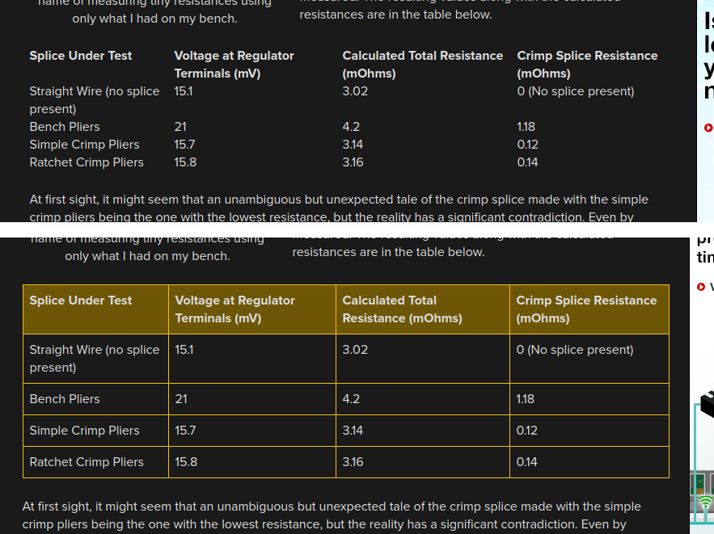
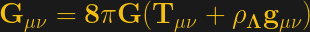

## Hackaday Howto

If you haven't already, go look at the [Hackaday Contributor Quick-Start Guide](https://docs.google.com/document/d/1LcUHBzFs0kHmT7zhJa6RcHX_XIC5TYAMjvlCsBobRGo/edit).  That document covers the mechanics of the tip line, working with Wordpress, and so on -- the really important stuff.  

This style guide is dedicated to the minutiae.  Is it "gcode" or "G-code"?  One dash or two?  Active or passive voice?  Read on to find out!

## Hackaday-Specific Affectations

* Voice: We write in the first-person plural.  We are Hackaday!  

    * We make an exception for long-form or personal opinion pieces, your own experience that's not likely to be shared across HaD, and rants.  This can be a fine line sometimes.  "When I got malaria in the jungle." vs. "We love open-source projects." is pretty clear.
    * Err on the side of "we" for blog posts.  

* We use one space after a period, not two.  

* Hacker names, pseudonyms, and handles are enclosed in square brackets.  This was originally intended to disambiguate "that nerdy hacker" from "[that nerdy hacker]", but now it's just tradition. It's not necessary for figures of historical importance, so don't write [Albert Einstein] -- reserve that for the hacker who goes by that handle.

* The first link in a blog post goes to the referenced web resource.  This can make writing an introductory paragraph contrived sometimes.  Sorry about that, but our readers expect to be able to click through on the top link.

* The Wikimedia copyright notice is unnecessarily verbose.  We use <pre>"Image title" by <a href="http://mediapage.Url">Creator</a></pre> if the link is to a person's webpage or <pre>"<a href="http://mediapage.Url">Image Title</a></pre>" by Creator if not. 

* Attribution: We do it whenever possible.  If you read about it in a third place, use a "via" link.

* Tipsters: We thank them. End the post with "Thanks [Hackerman] for the tip!"

* References to any Web resource is included in the body text as an HTML link.  If you're making a reference to a printed book, best is usually to cite it in text: (See _Understanding Digital Signal Processing_ by Richard G. Lyons).  If you have enough non-Web citations to warrant a bibliography, you can use a [1] notation.  Talk to an editor if you do this.

## Hackaday Specific Layout Trivia

* Never use two headings in a row -- it looks bad with our style. Similarly, don't start off a piece with a heading. Come up with an introductory paragraph to lead off the new section.

* Don't tell the reader where the image is ("as you see in the figure to the left") because editors often move images, and they may move around on their own in a (future) mobile-first Web design.  You _can_ presume that the reader can see the image, though, and you can refer to it. 

## Tenses and Voices

* Active voice is preferred over passive voice.  "[Joe] flashed his firmware into the Arduino" instead of "The firmware was flashed into the Arduino".

* If the post is written describing actions that occurred in the past, it's reasonable that they should be written up in the past tense.

* Sometimes, writers like to tell a narrative in the present tense.  If you try to do this, stay consistent.  

## "He", "She", or "They"? 

* The rule is to do what the hacker wants. If the hacker wants "he/him", "she/her", or "they/them", that's what you use.

* You should check for the hacker's preferred pronoun.

* If you can't find a preference, "he/him" and "she/her" are overwhelmingly the stated preference of those hackers who do state a preference, and make a good default. But you're taking a risk here.

* If you're unsure or uncomfortable, avoid pronouns entirely. Use the hacker's name, or simply write more about the hack and less about the hacker. That's what our readers are after anyway. "He put a gripper on the robot arm." should probably be "The robot arm has a jamming gripper that's particularly clever because..." anyway. 
 
## Punctuation, and its (Ab)uses

* Commas come in the sentence where you would take a breath or pause for a beat. This does not mean that every pause requires a comma.

    * Commas separate independent clauses: "She is smart, and she wields a mean soldering iron." 
    * Commas don't separate two actions that occur in sequence: "She finished her tee and left."
    * Commas separate list elements: "sex, drugs, and Arduinos".  
    * Hackaday style is to use the [serial comma](https://en.wikipedia.org/wiki/Serial_comma) -- the one just before the "and" -- in lists.  The best justification I've ever seen for this is the sentence "I love my parents, Lady Gaga and Humpty Dumpty".  
    * Commas offset parenthetical elements in a sentence: "[john doe], who we've featured before, is an anonymous hacker."

* The hyphen (single dash) makes a single unit out of two or more words, when the compound word modifies another and it's needed for clarity. It's like parentheses in math, but for language. 
    * "his awesome 3D-printing skills".  "3D-printing" modifies skills, but it's two words, and you could be confused if he had awesome, 3D, (printing skills).  A "flat-bed truck" is not a flat (bed truck).
    * Contrast: No dash in "3D printing is awesome" because 3D is a single word modifying printing.
    * The dash is _never_ needed when an adverb is one of the modifiers: "his simply fantastic prose" is fine, even though it's parsed as "(simply fantastic) prose".  The fact that it's an adverb is your clue that there are multiple modifiers at work. 
    * The hyphen is also used in ranges. "Pages 12-18", "1971-2007", etc.

* The em-dash (double dash) is an informal substitute for the parenthetical comma above.  It should be used in cases that are just slightly more parenthetical.  They should be offset on either side with a space.  "He hacked a Furby -- for whatever reason -- into a router."

* Parentheses are for material that doesn't fit the normal flow of the sentence.   In practice, when you have something to say that doesn't work in the sentence, it's best to split your sentence in two and re-write the parenthetical part so that it can stand on its own. If you absolutely can't, parenthesize. 
    * Entire parenthetical sentences, or asides, are useful if you are inserting your own opinion in piece that is otherwise written with the "Hackaday We". (Or at least that's why my editor said.)
    * Flag links to something other than a webpage with parentheses: "For details, check the documentation (PDF)." Or "[Meatballman7000] has a great video (embedded below)..."
    * Definitions and clarifications can work with parentheses, but you should prefer the comma. 

* Semicolons separate two complete sentences that nonetheless are part of a unitary whole.  They're a strange beast, but useful when you need them.  "I'd like a wheat beer; my dog will have the IPA."  Unlike the period, the second sentence is not capitalized. 

* Regular colons precede: lists, descriptions, definitions, and explanations.  

* Ellipses.  You probably don't need 'em except in excerpts of direct quotations.  Letting your thoughts trail off in ellipses is sloppy.  Take the time to finish the sentence.


## Numbers:

* Spell out numbers less than or equal to twenty.  "Seventeen frogs", and not "17 frogs".  

    * Do the same with units.  "Seven megabytes" but "28 GB".
    * Seventeenth, but 23rd.  
    * When mixing and matching, the digits win out.  "He took between 17 and 25 hours" is more readable than "he took between seventeen and 25 hours". 
    * Exceptions:
        * When the number is the name: "Pin 5" or "Pier 17".
	* Bits.  We've used "8-bit" forever.  No reason to change.

* Years: "1980s" or "'80s".  (Not possessive.)

* Commas every thousand help readability.  "3,542".  


## Units:

We [follow the NIST](https://www.nist.gov/pml/weights-and-measures/writing-metric-units) on this one. Here is the [NIST long version](https://www.nist.gov/physical-measurement-laboratory/special-publication-811), and here's our short version:

* If you use the number, use the abbreviated units. If you write out the number, write out the units.  Seventeen volts, but 23 V.

* A space goes between the number and the unit: "15 MHz", not "15MHz".  "5 V at 17 A".

* Capitalization of abbreviated unit names: all lower-case, except those derived from a person's name.  "12 m/s" but "12 W, 15 Pa, 1,000 A, 17.5 V".

* Capitalization of full unit names: the only ones capitalized are Celsius and Fahrenheit, because they're really "degrees Celsius" and "degrees Fahrenheit".  So "twelve watts, seven ohms, and fifteen pascals." (Yes, this is the opposite of the abbreviations.)

* Capitalization of [prefixes](https://www.nist.gov/pml/weights-and-measures/prefixes): they're all lower-case below Mega, and all upper-case above.  12 kΩ is twelve kilohms.  

* "15 MHz to 17 MHz" is preferable to "15 to 17 MHz". It's crystal clear, and it's what the NIST wants, and who are we to argue?

* Spaces around equals signs.  "I = 12 cm", not "I=12 cm".

* "kb" for kilobits, "kB" for kilobytes. However, there is long-standing ambiguity between the 1000-byte kB and the 1024-byte kB. The NIST wants you to use KiB [according to Wikipedia](https://en.wikipedia.org/wiki/Kibibyte) for the 1024 version, but our readers are fine with a "kg" being 1000 g and a "kB" being 1024 bytes. If it really matters, be explicit.

## Acronyms

Define an acronym on first use.  "Did you know that using a real-time operating system (RTOS) can make your programming life easier?  An RTOS is..."

* Exceptions are widely-known acronyms, where you'd just feel silly writing them out: "16 GB RAM", for instance.  This is a moving target.  This section needs fleshing out, or maybe just a list of the acronyms that _don't_ need spelling out.

* Don't introduce too many acronyms because they get hard to keep track of. Save them for things you're going to use often in the article.

## Sources in Non-English Languages

If you reference a page that is in a non-english language, please use the original link, but add a translate.google.com link to "(translated)" right after this. This way the source article gets traffic, and readers who want to translate into a language other than English have an easy path to do so.

* Paste the original language link into [translate.google.com](https://translate.google.com/), hit enter, copy the URL of the page that loads and use that. Here's an example:

> There are more detailed build instructions on [Nuremberg's FabLab page](http://wiki.fablab-nuernberg.de/w/Ding:Plotclock) ([translated](http://translate.google.com/translate?sl=auto&tl=en&js=n&prev=_t&hl=en&ie=UTF-8&u=http%3A%2F%2Fwiki.fablab-nuernberg.de%2Fw%2FDing%3APlotclock))

## Miscellanea 

* That / which: "That" is for details that are essential to the meaning of the sentence, and "which" is for additional info.  "To defuse the bomb, cut the wire that is flagged with tape."  "To defuse the bomb, which was planted by [Evil McNasty], our hero cut the wire."  You need to know which wire, but you don't need to know who planted the bomb, at least for the meaning of the sentence. 


## Capitalization:

In general, proper nouns are capitalized.

If it's a trademark, we defer to the entity that owns it for capitalization rules.  This can require some sleuthing: eBay's logo is lowercase, but their [corporate page](https://www.ebayinc.com/) consistently writes "eBay".  

Un-owned proper nouns are even more slippery.  We defer to Wikipedia on this one.

Here is a list of proper nouns / names that appear often, and this is how they're capitalized.  

* YouTube
* Internet
* the Web
* Ethernet
* KiCad
* Bluetooth
* WiFi
* eBay 
* GitHub
* DEF CON
* mbed
* G-code
* GNU
* Emacs
* GCC 
* Arduino
* BlackBerry

Acronyms that you'd think are capitalized, but have fallen out of fashion:

* laser 
* radar
* sonar
* scuba


Maybe this should be spun off into its own page.  

## Graphics and Other Visual Tricks

**Important**: If you are using Gimp to generate images, make sure to deselect "Save Color Profile" when saving the image. Jetpack Photon may change the colors in the image when resizing it if this meta is attached to the file. Here's a screenshot from Gimp 2.10.18:


### Blockquotes with Attribution

Our stylesheet already makes blockquote tags look great. But you can also style an attribution to the person who said the quote as follows:

```
<blockquote>MUDPIE represents an attempt to keep everyone up to date on the development of time-shared computing in museums and universities engaged in systematic research. Several individuals receiving this first copy had written asking the same questions, and this is a quick way of answering them.

There was a tremendous temptation to set it up so that it could be received only through the teletype and computer — but that proved to be a little too advanced for the present!
<span class="blockquote-attribution">Mark Twain</span></blockquote>
```


blockquotes can also be constrained to 50% and floated left or right by adding the class `blockquote-right` or `blockquote-left`. Here's an example: `<blockquote class="blockquote-right">`. This will affect desktop view but in mobile view the blockquote will be full width. This styling can be automatically added in the visual editor by using the "formats" dropdown menu.

### Graphic Quotes

It is always best to use great photos in the body of an article. When this is not possible, or when a quote is just too good, you may opt to use a graphic quote. Currently we format these manually. Make sure the quote is still in the body of the text so it is crawled by search engines (where text in a graphic will not be). This method is a way to break up a block of text and draw attention to the quote.

* [Article example with visual quote](http://hackaday.com/2016/12/05/self-driving-cars-are-not-yet-safe/) (scroll to bottom).
* [Gimp XCF file](files/hackaday-quote-in-body-tesla.xcf). BG color: 1a1a1a  FG color: f3bf10
* Site hosting [Century Schoolbook L Bold Italic TTF](https://ufonts.com/fonts/century-schoolbook-l-bold-italic.html)

### Schematic and Diagram Styling

With our dark background theme, white schematics and diagrams with black text are rather jarring to the eye. It is possible to use the yellow/black/white motif to [greatly improve the look of schematics and diagrams](https://hackadaycom.files.wordpress.com/2018/06/renesas-df2117vbg20v-block-diagram.png).

* Mike put together [a walkthrough of his workflow](lineart-styling-instructions.md)
* Mike put together a (poor recording quality) [video walkthrough](https://youtu.be/j6WkE8ZFqJw) of how to take a black/white diagram and apply these color styles using Gimp"
    * Please note the error in this video. Normally we prefer the line drawings to be yellow and the text to be white but it is reversed in this video. Otherwise the process is the same.
* Colors used: BG color: #1a1a1a  FG color: #f3bf10 Font: #ffffff 

### Table Styling

Tables are for the most part unstyled in the default Hackaday theme. However, there is a simple CSS table style set that can be used by wrapping your table in a `<div>` with the proper class. Styling is handled this way because it facilitates horizontal scrolling of tables when the screen is too narrow:

``` html
<div class="hackaday-table">
    <!-- table code goes here -->
</div>
```

There are three classes available that offer full-width, and 50% width floated left or right:

* hackaday-table
* hackaday-table-left
* hackaday-table-right

The resulting table will be styled with the yellow/black/white motif. Be sure to use `<th>` instead of `<td>` wherever you want to have the yellow color.

You can [easily generate tables using this web tool](https://www.tablesgenerator.com/html_tables) (protip: make sure the check the "Do not generate CSS" box).



### Formulas using LaTeX

Wordpress includes the ability to render LaTeX formulas. The formula should be pasted in the graphic editor. Here is an example of the theory of general relativity:

```$latex \bf G_{\mu \nu} = 8\pi G(T_{\mu \nu } + \rho_{\Lambda}g_{\mu \nu})&bg=1a1a1a&fg=f3bf10&s=3$```



* LaTeX formulas should begin `$latex` and end with `$`. We also use styling code like bold `\bf` and color/size directives `&bg=1a1a1a&fg=f3bf10&s=3`.

* It is easier to build your LaTeX in a live editor like [CodeCogs](https://www.codecogs.com/latex/eqneditor.php) (hover on each symbol menu to expand options) or [HostMath](https://www.hostmath.com/) before pasting it into Wordpress.

### Multi-column lists

There is a CSS element that lets you specify 2 or 3 columns in lists that will show only on wider screens:

* `<ul class="responsive-column-2"></ul>`
* `<ul class="responsive-column-3"></ul>`

### Errata and Other Frustrating Things

## Wordpress Photo Galleries workaround

The Wordpress Jetpack plugin provides some nice-looking photo gallery options, but it has a bug in Photon library that powers it regarding rotated images. Sometimes when you upload several images to be used in a "tiled mosaic" or other Photon-powered gallery, the aspect ratio will be confused causing stretched images.

It appears behavior is caused when uploading an image whose EXIF tag has rotation set, but image is actual 90 degrees off from that. A workaround is to rotate the image rather than relying on the EXIF rotation tag. This can be done in an image editor, but those with Linux may appreciate this command which will read the EXIF tag and automatically rotate the image file to match. Once done, this can be uploaded and used as part of a gallery without encountering the aspect ratio problem:

`renrot --no-rename --no-mtime image-to-be-rotated.jpg`

## Thanks

Thanks to everyone who's helped make this style guide complete and useful.  
